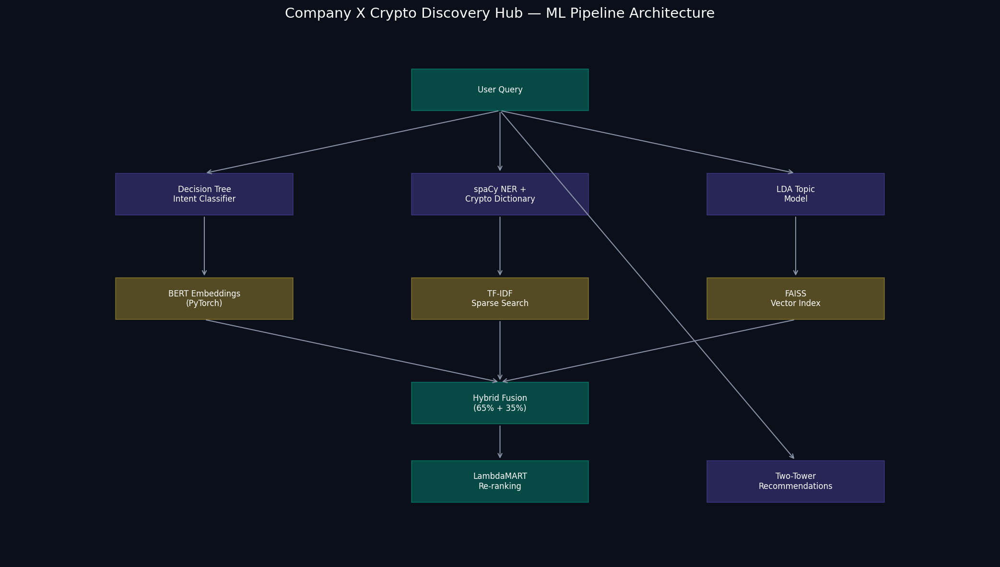
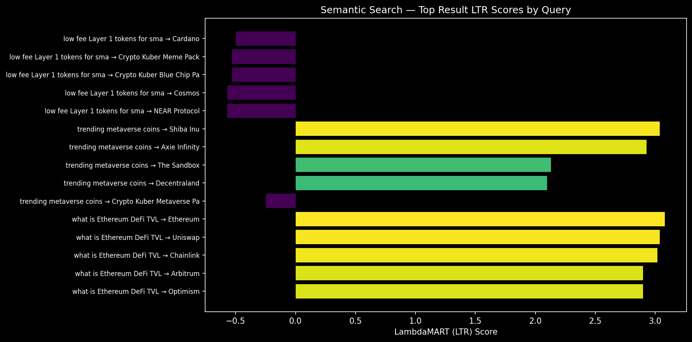
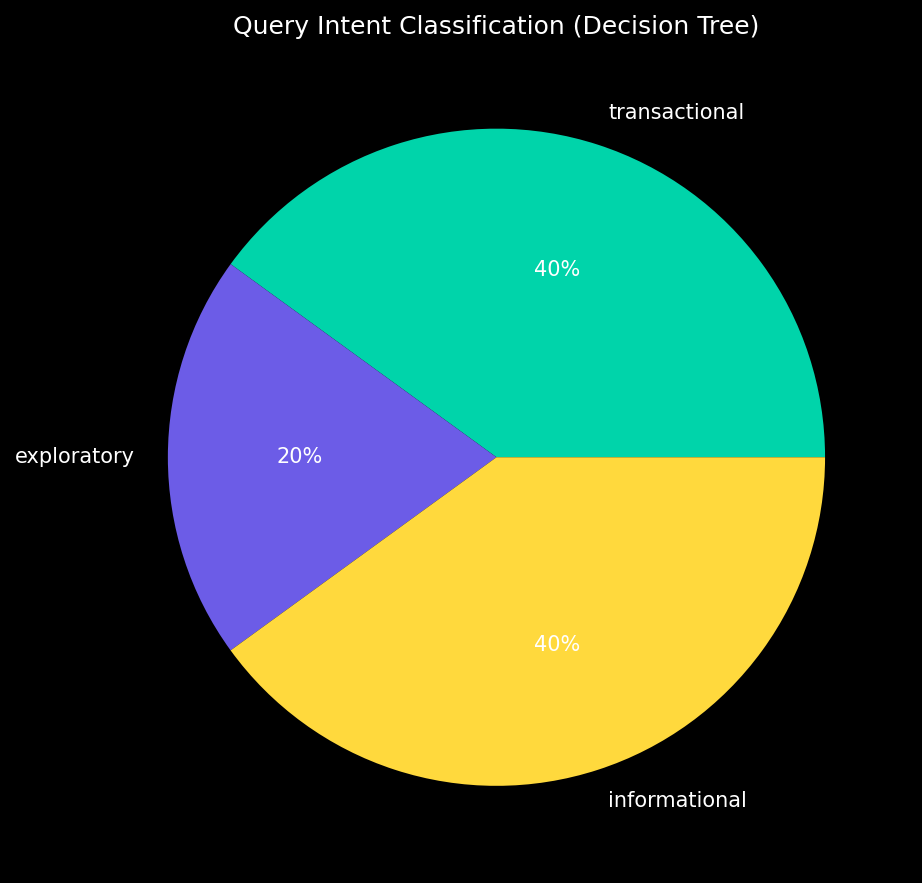
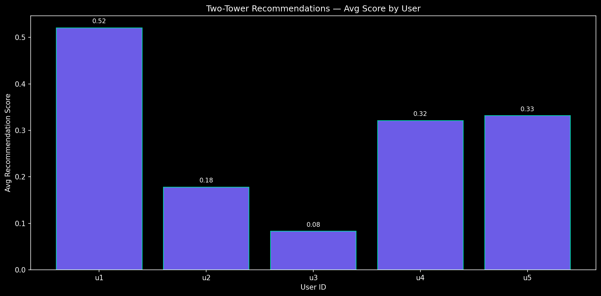
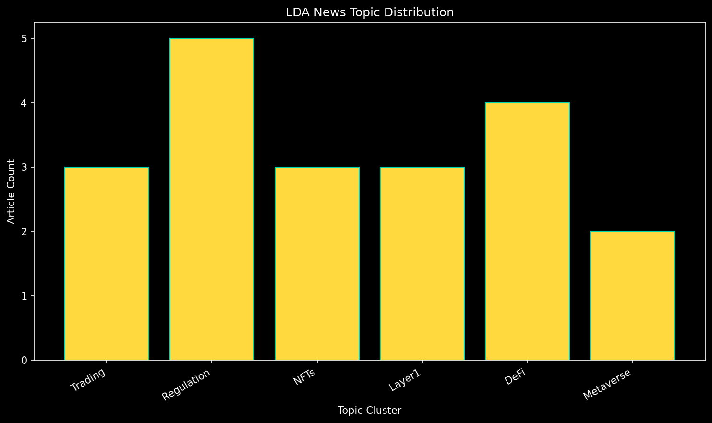

# Company X — Crypto Discovery Hub

**Demo run generated:** 2026-07-12 01:01:44

| Status | Pipeline | Artifacts |
|--------|----------|-----------|
| healthy | ready | 7/7 |

---

## Pipeline Architecture

---

## Visual Analytics

### Search LTR Scores

### Intent Distribution

### Recommendation Scores

### LDA Topic Clusters

---

## System Status

- **Health:** healthy
- **Pipeline:** ready
- **Artifacts ready:** 7/7

### ML Components

- semantic_search: BERT (PyTorch) + FAISS
- sparse_search: TF-IDF
- hybrid_fusion: 65% dense + 35% sparse
- learning_to_rank: LambdaMART (LightGBM)
- intent_classification: Decision Tree
- entity_extraction: spaCy NER + Crypto Dictionary
- topic_modeling: LDA (gensim)
- recommendations: Two-Tower (PyTorch)

## Semantic Search Results

### Query: "low fee Layer 1 tokens for smart contracts"

- **Intent:** transactional (100%)
- **Routing:** token_trade_pipeline
- **Entities:** tokens=[], categories=['layer1']

**Top Results:**

1. [token] Cardano (LTR: -0.497)
2. [bundle] Crypto Kuber Meme Pack (LTR: -0.530)
3. [bundle] Crypto Kuber Blue Chip Pack (LTR: -0.530)
4. [token] Cosmos (LTR: -0.570)
5. [token] NEAR Protocol (LTR: -0.570)

### Query: "trending metaverse coins"

- **Intent:** exploratory (100%)
- **Routing:** hybrid_search
- **Entities:** tokens=['sand', 'axs', 'mana', 'shib'], categories=['metaverse']

**Top Results:**

1. [token] Shiba Inu (LTR: 3.037)
2. [token] Axie Infinity (LTR: 2.928)
3. [token] The Sandbox (LTR: 2.132)
4. [token] Decentraland (LTR: 2.099)
5. [bundle] Crypto Kuber Metaverse Pack (LTR: -0.247)

### Query: "what is Ethereum DeFi TVL"

- **Intent:** informational (97%)
- **Routing:** news_and_education
- **Entities:** tokens=['arb', 'link', 'op', 'uni', 'aave', 'avax', 'matic', 'eth'], categories=['defi']

**Top Results:**

1. [token] Ethereum (LTR: 3.079)
2. [token] Uniswap (LTR: 3.039)
3. [token] Chainlink (LTR: 3.018)
4. [token] Arbitrum (LTR: 2.900)
5. [token] Optimism (LTR: 2.900)

### Query: "buy DeFi lending tokens"

- **Intent:** transactional (100%)
- **Routing:** token_trade_pipeline
- **Entities:** tokens=['arb', 'link', 'op', 'aave', 'avax', 'uni', 'eth'], categories=['defi']

**Top Results:**

1. [token] Uniswap (LTR: 3.082)
2. [token] Chainlink (LTR: 3.080)
3. [token] Ethereum (LTR: 3.019)
4. [token] Avalanche (LTR: 2.933)
5. [token] Arbitrum (LTR: 2.906)

### Query: "crypto regulation news today"

- **Intent:** informational (97%)
- **Routing:** news_and_education
- **Entities:** tokens=[], categories=[]

**Top Results:**

1. [news] SEC Proposes New Crypto Regulation Framework (LTR: -0.247)
2. [news] EU MiCA Regulation Takes Effect for Stablecoins (LTR: -0.247)
3. [token] Ripple (LTR: -0.470)
4. [token] Avalanche (LTR: -0.470)
5. [news] Avalanche Subnets Power Enterprise Blockchain Pilots (LTR: -0.479)

## Personalized Recommendations (Two-Tower)

### User u1

1. [token] NEAR Protocol (score: 0.875)
2. [bundle] Crypto Kuber Layer 1 Pack (score: 0.551)
3. [token] Bitcoin (score: 0.475)
4. [token] Solana (score: 0.470)
5. [token] Cardano (score: 0.465)
6. [news] Solana Network Upgrade Cuts Transaction Fees (score: 0.458)
7. [news] Cosmos IBC Volume Breaks Monthly Record (score: 0.445)
8. [token] Ripple (score: 0.426)

### User u2

1. [bundle] Crypto Kuber Metaverse Pack (score: 0.782)
2. [bundle] Crypto Kuber Blue Chip Pack (score: 0.506)
3. [news] Metaverse Land Sales Hit Record in The Sandbox (score: 0.308)
4. [token] Polkadot (score: 0.057)
5. [news] Altcoin Rotation Strategy Gains Among Swing Traders (score: 0.034)
6. [bundle] Crypto Kuber Layer 1 Pack (score: -0.034)
7. [token] Cosmos (score: -0.084)
8. [news] Crypto Day Traders Shift to Layer 2 Tokens (score: -0.143)

### User u3

1. [token] Ethereum (score: 0.357)
2. [bundle] Crypto Kuber Metaverse Pack (score: 0.215)
3. [bundle] Crypto Kuber Layer 1 Pack (score: 0.100)
4. [token] NEAR Protocol (score: 0.021)
5. [token] Solana (score: 0.006)
6. [news] Metaverse Land Sales Hit Record in The Sandbox (score: -0.001)
7. [bundle] Crypto Kuber Blue Chip Pack (score: -0.011)
8. [token] Cardano (score: -0.024)

### User u4

1. [bundle] Crypto Kuber Layer 1 Pack (score: 0.690)
2. [token] Avalanche (score: 0.662)
3. [news] Solana Network Upgrade Cuts Transaction Fees (score: 0.415)
4. [token] Ethereum (score: 0.199)
5. [token] Solana (score: 0.190)
6. [token] Cardano (score: 0.185)
7. [token] NEAR Protocol (score: 0.145)
8. [token] Bitcoin (score: 0.081)

### User u5

1. [token] Dogecoin (score: 0.549)
2. [bundle] Crypto Kuber Meme Pack (score: 0.464)
3. [token] Shiba Inu (score: 0.456)
4. [token] Cardano (score: 0.382)
5. [bundle] Crypto Kuber Layer 1 Pack (score: 0.336)
6. [news] Cosmos IBC Volume Breaks Monthly Record (score: 0.178)
7. [token] Ethereum (score: 0.145)
8. [token] Avalanche (score: 0.140)

## Combined Discovery Hub

**Query: "trending metaverse coins" | User: Bob (u2)**
**Risk: high | Portfolio: sol, sand, mana, axs**

## LDA News Topic Clusters

| Topic | Articles |
|-------|----------|
- Regulation: 5 articles
- DeFi: 4 articles
- Trading: 3 articles
- NFTs: 3 articles
- Layer1: 3 articles
- Metaverse: 2 articles