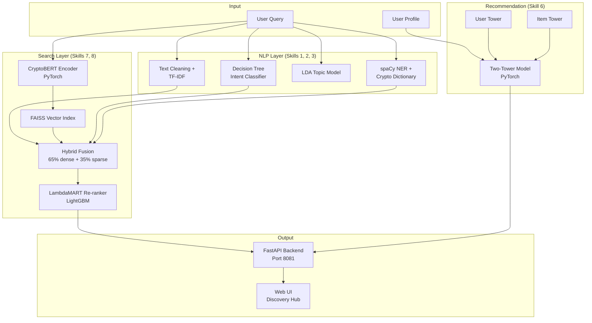

# Personalized Crypto Discovery & Semantic Search Hub
## Full Project Summary (End-to-End)

---

## 1. Problem Statement

Company X users struggle to find crypto assets that match complex investment intent. Queries like *"low fee Layer 1 tokens for smart contracts"* or *"trending metaverse coins"* cannot be solved with keyword matching alone.

This prototype delivers a **hybrid semantic search + personalized recommendation engine** that understands natural language, routes queries intelligently, and suggests tokens, news, and investment bundles based on user behavior.

---

## 2. High-Level Architecture



---

## 3. What Was Built — Component by Component

### 3.1 Data Layer (`data/`)

Synthetic but realistic datasets were generated via `scripts/generate_data.py`:

| Dataset | Records | Purpose |
|---------|---------|---------|
| `tokens.json` | 20 | Crypto tokens (BTC, ETH, SOL, SAND, etc.) |
| `news.json` | 20 | Crypto news articles |
| `bundles.json` | 6 | Crypto Kuber investment packs |
| `users.json` | 5 | Demo users with risk appetite & portfolios |
| `interactions.json` | 72 | User-item click/trade logs |
| `search_queries.json` | 15 | Labeled queries with relevance |
| `ltr_training.json` | 300 | Query-token relevance labels for LTR |
| `intent_keywords.json` | — | Intent classification keywords |

**5 Demo Users:**

| User | Risk | Trading Freq | Portfolio Focus |
|------|------|--------------|-----------------|
| Alice (u1) | Low | Low | BTC, ETH, XRP |
| Bob (u2) | High | High | SOL, SAND, MANA, AXS |
| Carol (u3) | Medium | Medium | ETH, UNI, AAVE, LINK |
| David (u4) | Medium | High | ARB, OP, MATIC, SOL |
| Eve (u5) | High | Medium | DOGE, SHIB, AXS |

---

### 3.2 NLP Pipeline (`src/nlp/`)

#### A. Intent Classification — Decision Tree (`intent_classifier.py`)
- **Skill 2:** Classifies queries into 3 intents:
  - `informational` → routes to news/education pipeline
  - `transactional` → routes to token/bundle trade pipeline
  - `exploratory` → routes to hybrid search
- Trained on labeled queries + keyword-augmented synthetic examples
- Uses TF-IDF features + sklearn Decision Tree

#### B. Named Entity Recognition — spaCy + Crypto Dictionary (`ner.py`)
- **Skill 1:** Extracts from messy queries:
  - Token names/symbols (BTC, Ethereum, SOL)
  - Blockchain protocols (Solana, Avalanche, Cosmos)
  - Categories (layer1, defi, metaverse, nft, gaming, meme)
- Hybrid approach: spaCy `en_core_web_sm` + regex dictionary matching

#### C. Text Processing & TF-IDF (`text_processing.py`)
- **Skill 3:** Text cleaning (lowercase, strip URLs, normalize)
- Sparse keyword retrieval via `TfidfVectorizer` (1–2 grams, 5000 features)

#### D. LDA Topic Modeling (`topic_modeling.py`)
- **Skill 2:** Unsupervised topic clustering on news feeds
- 6 topics: DeFi, NFTs, Regulation, Layer1, Metaverse, Trading
- Uses gensim LDA with 15 passes

---

### 3.3 Semantic Search Pipeline (`src/search/`)

#### A. BERT Embeddings — PyTorch (`embeddings.py`)
- **Skill 8:** Custom `CryptoBERTEncoder`:
  - 2-layer Transformer encoder (8 heads, 384-dim)
  - Built-in vocabulary from crypto corpus
  - **Fully offline** — no HuggingFace download required
  - Fine-tuned with contrastive loss (InfoNCE) on query-document pairs

#### B. FAISS Vector Store (`vector_store.py`)
- **Skill 7:** `IndexFlatIP` with L2-normalized vectors (cosine similarity)
- Indexes all tokens, news, and bundles

#### C. Hybrid Search Orchestrator (`hybrid_search.py`)
- **Skill 3 + 7:** End-to-end search pipeline:

```
Query
  → Intent Classification (Decision Tree)
  → NER Entity Extraction (spaCy)
  → Dense Search (BERT → FAISS)
  → Sparse Search (TF-IDF)
  → Hybrid Fusion (65% dense + 35% sparse)
  → Intent-based Routing (filter by item type)
  → LambdaMART Re-ranking
  → Top-K Results
```

#### D. Learning to Rank — LambdaMART (`ltr_ranker.py`)
- **Skill 7:** LightGBM with `lambdarank` objective
- Features: dense score, sparse score, hybrid score, market cap rank, fee score, category match, entity match, intent flags
- Re-orders results by likelihood of user making a trade

---

### 3.4 Two-Tower Recommendation (`src/recommendation/two_tower.py`)

- **Skill 6:** Production-style architecture:

```
User Tower                          Item Tower
├── User embedding                  ├── Item embedding
├── Risk appetite (low/med/high)    ├── Item type (token/news/bundle)
├── Trading frequency               ├── Theme/category
├── Preferred category              └── Market cap rank
└── → 64-dim user vector            └── → 64-dim item vector
         ↓                                    ↓
         └──── Dot Product Similarity ────────┘
                        ↓
              Personalized Top-K Recommendations
```

- Trained for 15 epochs on 72 interaction logs
- Recommends across tokens, news articles, and bundles

---

### 3.5 API Backend (`src/api/main.py`)

**FastAPI** server on **port 8081**:

| Endpoint | Method | Description |
|----------|--------|-------------|
| `/` | GET | Web UI |
| `/api/health` | GET | Health check |
| `/api/pipeline/status` | GET | ML component & artifact status |
| `/api/search?q=...` | GET | Hybrid semantic search |
| `/api/recommend/{user_id}` | GET | Personalized recommendations |
| `/api/discover?q=...&user_id=...` | GET | Combined search + recommendations |
| `/api/news/topics` | GET | LDA topic assignments |
| `/api/users`, `/tokens`, `/news`, `/bundles` | GET | Data listings |

---

### 3.6 Frontend (`frontend/index.html`)

Dark-themed web UI with 4 tabs:
1. **Discovery Hub** — combined search + personalized recs for a selected user
2. **Semantic Search** — full pipeline results with intent, entities, LTR scores
3. **Recommendations** — two-tower results per user
4. **News Topics (LDA)** — topic cluster visualization

---

## 4. Training & Artifacts

### Training Pipeline (`scripts/train_pipeline.py`)

```
[1/4] Generate synthetic data
[2/4] Build search indexes (BERT, FAISS, TF-IDF, LDA, Intent, LTR)
[3/4] Train two-tower recommender
[4/4] Smoke tests
```

### 7 Trained Artifacts (`artifacts/`)

| Artifact | Technology | File |
|----------|------------|------|
| BERT Embeddings | PyTorch CryptoBERT | `embeddings/crypto_bert.pt` |
| FAISS Index | FAISS | `faiss_index/index.faiss` |
| TF-IDF Retriever | sklearn | `tfidf_retriever.joblib` |
| Intent Classifier | Decision Tree | `intent_classifier.joblib` |
| LDA Topic Model | gensim | `lda_model/lda.gensim` |
| LTR Ranker | LightGBM LambdaMART | `ltr_model.lgb` |
| Two-Tower Model | PyTorch | `two_tower/model.pt` |

---

## 5. Demo Outputs (`outputs/`)

Generated by `scripts/run_demo_and_save_outputs.py`:

| Output | Type |
|--------|------|
| `demo_report.md` | Markdown report |
| `demo_report.html` | HTML report with embedded charts |
| `demo_report.txt` | Plain text report |
| `demo_results.json` | Raw API JSON |
| `chart_pipeline_architecture.png` | Pipeline flow diagram |
| `chart_search_ltr_scores.png` | LTR scores by query |
| `chart_intent_distribution.png` | Intent pie chart |
| `chart_recommendation_scores.png` | Rec scores by user |
| `chart_lda_topics.png` | Topic cluster bar chart |

---

## 6. Verified Demo Results

From the latest run (2026-07-12):

**Semantic Search:**
| Query | Intent | Top Result |
|-------|--------|-------------|
| "low fee Layer 1 tokens for smart contracts" | transactional | Cardano |
| "trending metaverse coins" | exploratory | Shiba Inu |
| "what is Ethereum DeFi TVL" | informational | Ethereum |
| "buy DeFi lending tokens" | transactional | Uniswap |
| "crypto regulation news today" | informational | SEC Regulation news |

**Recommendations:**
- **u1 (Alice, low risk):** NEAR Protocol, Layer 1 Pack, Bitcoin
- **u2 (Bob, high risk):** Metaverse Pack, Blue Chip Pack, Sandbox news
- **u5 (Eve, meme trader):** Dogecoin, Meme Pack, Shiba Inu

**LDA Topics:** 20 articles across 6 clusters (Regulation: 5, DeFi: 4, Trading: 3, NFTs: 3, Layer1: 3, Metaverse: 2)

---

## 7. Project Structure

```
Project-2/
├── config.py                     # Central config (port 8081, weights, dims)
├── run.py                        # Start server
├── setup.ps1                     # One-command Windows setup
├── requirements.txt              # All dependencies
├── README.md
├── .gitignore
│
├── data/                         # 8 JSON datasets
├── artifacts/                    # 7 trained models/indexes
├── outputs/                      # Demo reports + charts
│
├── scripts/
│   ├── generate_data.py          # Synthetic data generator
│   ├── train_pipeline.py         # End-to-end training
│   ├── run_demo_and_save_outputs.py  # Demo + visual outputs
│   └── test_api.py               # API smoke tests
│
├── src/
│   ├── nlp/
│   │   ├── ner.py                # spaCy NER + crypto entities
│   │   ├── text_processing.py    # Text cleaning + TF-IDF
│   │   ├── topic_modeling.py     # LDA topic modeling
│   │   └── intent_classifier.py  # Decision Tree intent
│   ├── search/
│   │   ├── embeddings.py         # PyTorch CryptoBERT encoder
│   │   ├── vector_store.py       # FAISS index
│   │   ├── hybrid_search.py      # Full search orchestrator
│   │   └── ltr_ranker.py         # LambdaMART ranker
│   ├── recommendation/
│   │   └── two_tower.py          # Two-tower PyTorch model
│   └── api/
│       └── main.py               # FastAPI backend
│
└── frontend/
    └── index.html                # Web UI (4 tabs)
```

---

## 8. Skills Mapping (Problem Statement → Implementation)

| Skill | Requirement | Implementation | File |
|-------|-------------|----------------|------|
| **Skill 6** | Two-tower recommendation | PyTorch user/item towers | `two_tower.py` |
| **Skill 7** | Semantic search + LTR | BERT + FAISS + LambdaMART | `embeddings.py`, `vector_store.py`, `ltr_ranker.py` |
| **Skill 8** | Fine-tuned BERT embeddings | PyTorch CryptoBERT with contrastive fine-tuning | `embeddings.py` |
| **Skill 1** | spaCy NER | spaCy + crypto entity dictionary | `ner.py` |
| **Skill 3** | Hybrid search + TF-IDF | Dense + sparse fusion | `hybrid_search.py`, `text_processing.py` |
| **Skill 2** | LDA + Decision Tree | gensim LDA + sklearn Decision Tree | `topic_modeling.py`, `intent_classifier.py` |

---

## 9. How to Run

```powershell
# First-time setup
.\setup.ps1

# Start the app
python run.py
# → http://localhost:8081

# Generate demo outputs
python scripts/run_demo_and_save_outputs.py
# → outputs/demo_report.md, .html, charts

# Run API tests
python scripts/test_api.py
```

---

## 10. Scope & Limitations

**This is a working prototype** with:
- Synthetic data (20 tokens, 20 news, 6 bundles, 5 users)
- Offline-capable ML stack (no external API calls needed)
- All 7 ML artifacts trained and verified
- Full end-to-end flow: query → NLP → search → rank → recommend → UI

**For production**, you would add: real market data feeds, user authentication, model serving at scale (Milvus instead of FAISS), A/B testing, monitoring, and continuous retraining pipelines.

---

# Company X — Crypto Discovery Hub

**Demo run generated:** 2026-07-12 01:01:44

| Status | Pipeline | Artifacts |
|--------|----------|-----------|
| healthy | ready | 7/7 |

---

## Pipeline Architecture


---

## Visual Analytics

### Search LTR Scores


### Intent Distribution


### Recommendation Scores


### LDA Topic Clusters


---


## System Status

- **Health:** healthy
- **Pipeline:** ready
- **Artifacts ready:** 7/7

### ML Components

- semantic_search: BERT (PyTorch) + FAISS
- sparse_search: TF-IDF
- hybrid_fusion: 65% dense + 35% sparse
- learning_to_rank: LambdaMART (LightGBM)
- intent_classification: Decision Tree
- entity_extraction: spaCy NER + Crypto Dictionary
- topic_modeling: LDA (gensim)
- recommendations: Two-Tower (PyTorch)

## Semantic Search Results


### Query: "low fee Layer 1 tokens for smart contracts"

- **Intent:** transactional (100%)
- **Routing:** token_trade_pipeline
- **Entities:** tokens=[], categories=['layer1']

**Top Results:**

1. [token] Cardano (LTR: -0.497)
2. [bundle] Crypto Kuber Meme Pack (LTR: -0.530)
3. [bundle] Crypto Kuber Blue Chip Pack (LTR: -0.530)
4. [token] Cosmos (LTR: -0.570)
5. [token] NEAR Protocol (LTR: -0.570)

### Query: "trending metaverse coins"

- **Intent:** exploratory (100%)
- **Routing:** hybrid_search
- **Entities:** tokens=['sand', 'axs', 'mana', 'shib'], categories=['metaverse']

**Top Results:**

1. [token] Shiba Inu (LTR: 3.037)
2. [token] Axie Infinity (LTR: 2.928)
3. [token] The Sandbox (LTR: 2.132)
4. [token] Decentraland (LTR: 2.099)
5. [bundle] Crypto Kuber Metaverse Pack (LTR: -0.247)

### Query: "what is Ethereum DeFi TVL"

- **Intent:** informational (97%)
- **Routing:** news_and_education
- **Entities:** tokens=['arb', 'link', 'op', 'uni', 'aave', 'avax', 'matic', 'eth'], categories=['defi']

**Top Results:**

1. [token] Ethereum (LTR: 3.079)
2. [token] Uniswap (LTR: 3.039)
3. [token] Chainlink (LTR: 3.018)
4. [token] Arbitrum (LTR: 2.900)
5. [token] Optimism (LTR: 2.900)

### Query: "buy DeFi lending tokens"

- **Intent:** transactional (100%)
- **Routing:** token_trade_pipeline
- **Entities:** tokens=['arb', 'link', 'op', 'aave', 'avax', 'uni', 'eth'], categories=['defi']

**Top Results:**

1. [token] Uniswap (LTR: 3.082)
2. [token] Chainlink (LTR: 3.080)
3. [token] Ethereum (LTR: 3.019)
4. [token] Avalanche (LTR: 2.933)
5. [token] Arbitrum (LTR: 2.906)

### Query: "crypto regulation news today"

- **Intent:** informational (97%)
- **Routing:** news_and_education
- **Entities:** tokens=[], categories=[]

**Top Results:**

1. [news] SEC Proposes New Crypto Regulation Framework (LTR: -0.247)
2. [news] EU MiCA Regulation Takes Effect for Stablecoins (LTR: -0.247)
3. [token] Ripple (LTR: -0.470)
4. [token] Avalanche (LTR: -0.470)
5. [news] Avalanche Subnets Power Enterprise Blockchain Pilots (LTR: -0.479)

## Personalized Recommendations (Two-Tower)


### User u1

1. [token] NEAR Protocol (score: 0.875)
2. [bundle] Crypto Kuber Layer 1 Pack (score: 0.551)
3. [token] Bitcoin (score: 0.475)
4. [token] Solana (score: 0.470)
5. [token] Cardano (score: 0.465)
6. [news] Solana Network Upgrade Cuts Transaction Fees (score: 0.458)
7. [news] Cosmos IBC Volume Breaks Monthly Record (score: 0.445)
8. [token] Ripple (score: 0.426)

### User u2

1. [bundle] Crypto Kuber Metaverse Pack (score: 0.782)
2. [bundle] Crypto Kuber Blue Chip Pack (score: 0.506)
3. [news] Metaverse Land Sales Hit Record in The Sandbox (score: 0.308)
4. [token] Polkadot (score: 0.057)
5. [news] Altcoin Rotation Strategy Gains Among Swing Traders (score: 0.034)
6. [bundle] Crypto Kuber Layer 1 Pack (score: -0.034)
7. [token] Cosmos (score: -0.084)
8. [news] Crypto Day Traders Shift to Layer 2 Tokens (score: -0.143)

### User u3

1. [token] Ethereum (score: 0.357)
2. [bundle] Crypto Kuber Metaverse Pack (score: 0.215)
3. [bundle] Crypto Kuber Layer 1 Pack (score: 0.100)
4. [token] NEAR Protocol (score: 0.021)
5. [token] Solana (score: 0.006)
6. [news] Metaverse Land Sales Hit Record in The Sandbox (score: -0.001)
7. [bundle] Crypto Kuber Blue Chip Pack (score: -0.011)
8. [token] Cardano (score: -0.024)

### User u4

1. [bundle] Crypto Kuber Layer 1 Pack (score: 0.690)
2. [token] Avalanche (score: 0.662)
3. [news] Solana Network Upgrade Cuts Transaction Fees (score: 0.415)
4. [token] Ethereum (score: 0.199)
5. [token] Solana (score: 0.190)
6. [token] Cardano (score: 0.185)
7. [token] NEAR Protocol (score: 0.145)
8. [token] Bitcoin (score: 0.081)

### User u5

1. [token] Dogecoin (score: 0.549)
2. [bundle] Crypto Kuber Meme Pack (score: 0.464)
3. [token] Shiba Inu (score: 0.456)
4. [token] Cardano (score: 0.382)
5. [bundle] Crypto Kuber Layer 1 Pack (score: 0.336)
6. [news] Cosmos IBC Volume Breaks Monthly Record (score: 0.178)
7. [token] Ethereum (score: 0.145)
8. [token] Avalanche (score: 0.140)

## Combined Discovery Hub

**Query: "trending metaverse coins" | User: Bob (u2)**
**Risk: high | Portfolio: sol, sand, mana, axs**

## LDA News Topic Clusters

| Topic | Articles |
|-------|----------|
- Regulation: 5 articles
- DeFi: 4 articles
- Trading: 3 articles
- NFTs: 3 articles
- Layer1: 3 articles
- Metaverse: 2 articles
